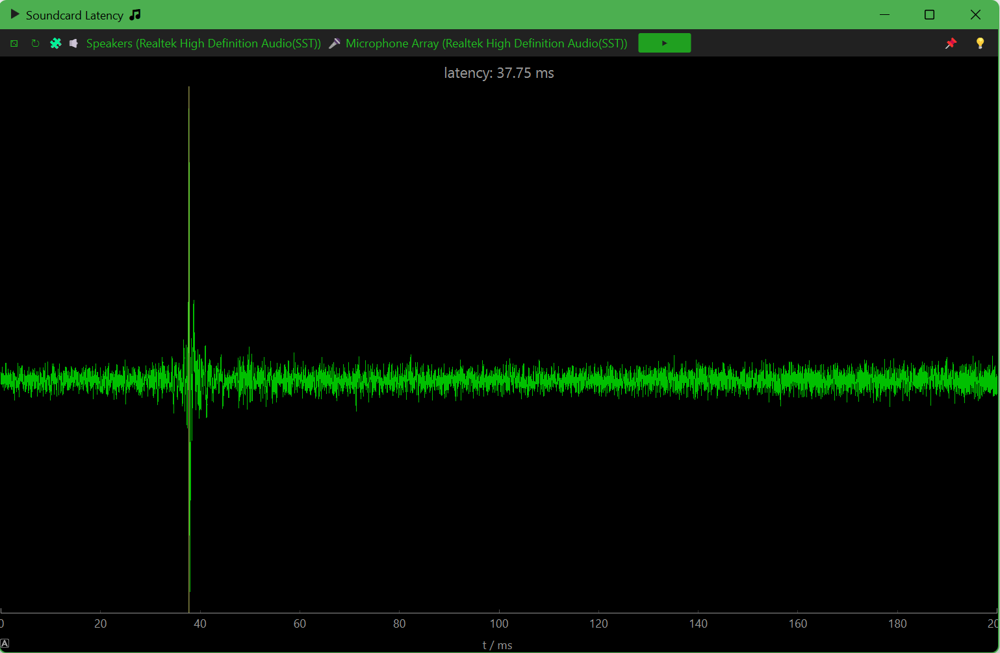

Soundcard Latency
=================
## 示意图
这个工具是我同事写的，但是没有示意图，有时候我也经常忘记这个工具怎么使用，我画了一个示意图


[](https://github.com/xiongyihui/soundcard-latency/actions/workflows/build.yml)

A tool to check the latency of a sound card.



Download the application from [](https://github.com/xiongyihui/soundcard-latency/actions/workflows/build.yml).

## Advance
### Requirements
+ python3
+ numpy
+ python-sounddevice
+ samplerate
+ matplotlib
+ pip3 install numpy
+ pip3 install matplotlib
+ pip3 install samplerate
+ pip3 install sounddevice

### Get started with `latency.py`
+   Measure the default input and output devices.

    ```
    python3 latency.py
    ```

+   Measure two specified devices

    1.  list all devices

        ```
        python3 -m sounddevice
        ```

    2.  use the indexes to specify two devices

        ```
        python3 latency 1 2
        ```

